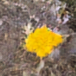

# Plantgen




_Images generated by Plantgen. Prompts (left to right): purple flower, blue flower, orange flower, red flower, white flower, yellow flower._

🤗 [Hugging Face](https://huggingface.co/groloch/Plantgen) | 🖥️ [Demo](https://huggingface.co/spaces/groloch/Plantgen_demo) 

## Overview
This is a re-implementation of the full [Stable Diffusion 3 pipeline](https://arxiv.org/pdf/2403.03206) on the [PlantNet300k](https://github.com/plantnet/PlantNet-300K) dataset, with the goal of training a text-to-image model for plant image generation. The pipeline includes:
- Dataset annotations using [Qwen3VL-4b](https://huggingface.co/Qwen/Qwen3-VL-4B-Instruct).
- VAE training on the PlantNet300k dataset (optional [IAF](https://arxiv.org/abs/1606.04934)).
- Projection of the dataset into latent space using the trained VAE.
- MM-DiT training on the annotated dataset (optional use of pre-computed latents).
- Gradio demo for image generation.

## Usage

First, you need to clone the repository:
```bash
git clone
```

Then, you can run the different stages of the pipeline by using different configuration files.

To train the VAE, use:
```bash
python -m src.plantgen config/vae/vae_training_config.yaml
```

To pre-compute the latents, use:
```bash
python -m src.plantgen.scripts.encode_dataset <config_path> <save_path> [image_size] [batch_size]
```

To annotate the dataset, use:
```bash
python -m src.plantgen.scripts.annotate_dataset
```

To train the diffusion model, use:
```bash
python -m src.plantgen config/flowmatching/flowmatching_training_config.yaml
```

Alternatively, if you have pre-computed latents, you can use:
```bash
python -m src.plantgen config/flowmatching/flowmatching_training_config_precomp.yaml
```
Make sure to adjust the config according to where you saved the latents.

The default provided configs are set to the settings used for the final models training.

To access the local demo (and vae script for generation), change the type in the logged config file to 'flowmatching_demo' (or 'vae_gen' for the vae script) and run the same command as for training. This is a bit hacky, but it allows to reuse the same config for training and generation.

## Load from Hugging Face Hub

The trained models are available on the HuggingFaceHub. You can see an example of how to load the pipeline and generate images in the [`hf_hub_test`](src/plantgen/scripts/hf_hub_test.py) script